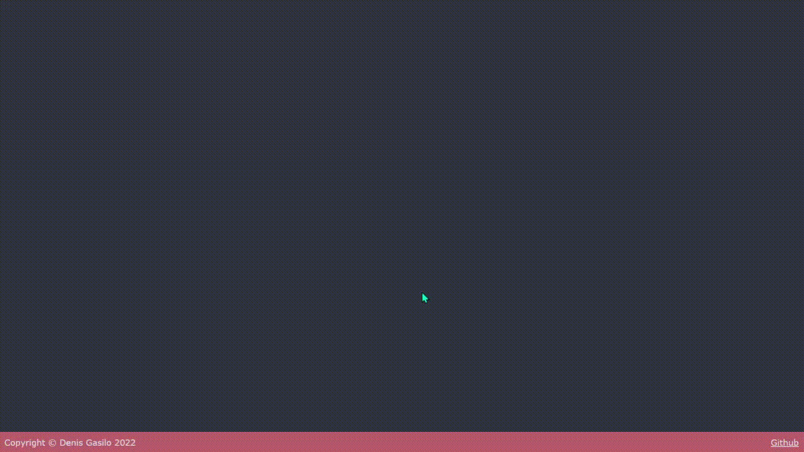

# RunAwayButton
## Gamerule
After pressing the start button, you start the game from score 0 and speed min. 
On game page 3 buttons are "Speed", "Score" and "Won't catch me".
### The button "Speed"
The button "Speed" changes speed button "Won't catch me". You have 3 speed min, mid, max.

To change the speed click the button "Speed", you need to enter the speed in the window that appears, or just press ok - then the speed will change from lower to higher in a circle.

1. <b>min</b> - Button "Won't catch me" movement speed is not fast and move only the x-axis.
2. <b>mid</b> - Button "Won't catch me" movement speed is fast and move only the x-axis.
3. <b>max</b> - Button "Won't catch me" movement speed is fast and move the x and y axis.

### The button "Score"
The "Score" button shows how many score you have earned and how many times you have won at different speeds.

Preview:

